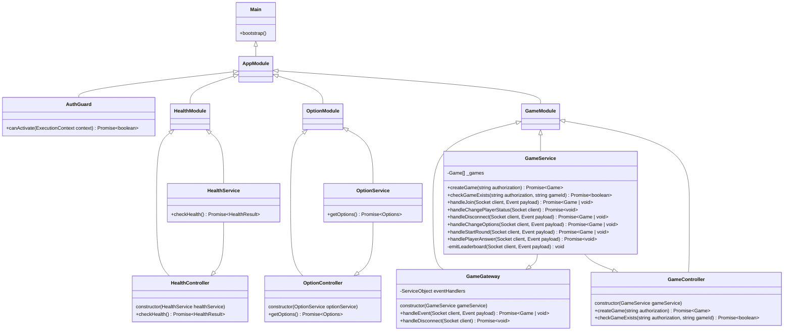

[← Go back](../README.md)

# API Class Diagram

```mermaid
classDiagram
class Main {
+bootstrap()
}

%% Main module
class AppModule

%% Guards
class AuthGuard {
    +canActivate(ExecutionContext context) Promise~boolean~
}

%% Information routes
class HealthModule
class HealthController {
    constructor(HealthService healthService)
    +checkHealth() Promise~HealthResult~
}
class HealthService {
    +checkHealth() Promise~HealthResult~
}

class OptionModule
class OptionController {
    constructor(OptionService optionService)
    +getOptions() Promise~Options~
}
class OptionService {
    +getOptions() Promise~Options~
}

%% Game routes
class GameModule
class GameGateway {
    constructor(GameService gameService)
    -ServiceObject eventHandlers
    +handleEvent(Socket client, Event payload) Promise~Game | void~
    +handleDisconnect( Socket client) Promise~void~
}
class GameController {
    constructor(GameService gameService)
    +createGame(string authorization) Promise~Game~
    +checkGameExists(string authorization, string gameId) Promise~boolean~
}
class GameService {
    -Game[] _games
    +createGame(string authorization) Promise~Game~
    +checkGameExists(string authorization, string gameId) Promise~boolean~
    +handleJoin(Socket client, Event payload) Promise~Game | void~
    +handleChangePlayerStatus(Socket client) Promise~void~
    +handleDisconnect(Socket client, Event payload) Promise~Game | void~
    +handleChangeOptions(Socket client, Event payload) Promise~Game | void~
    +handleStartRound(Socket client, Event payload) Promise~Game | void~
    +handlePlayerAnswer(Socket client, Event payload) Promise~void~
    -emitLeaderboard(Socket client, Event payload) void
}

%% Relations
Main <|-- AppModule
AppModule <|-- AuthGuard

AppModule <|-- HealthModule
AppModule <|-- OptionModule
AppModule <|-- GameModule

HealthModule <|-- HealthController
HealthModule <|-- HealthService

HealthService --|> HealthController

OptionModule <|-- OptionController
OptionModule <|-- OptionService

OptionService --|> OptionController

GameModule <|-- GameGateway
GameModule <|-- GameService
GameModule <|-- GameController

GameService --|> GameGateway
GameService --|> GameController
```
