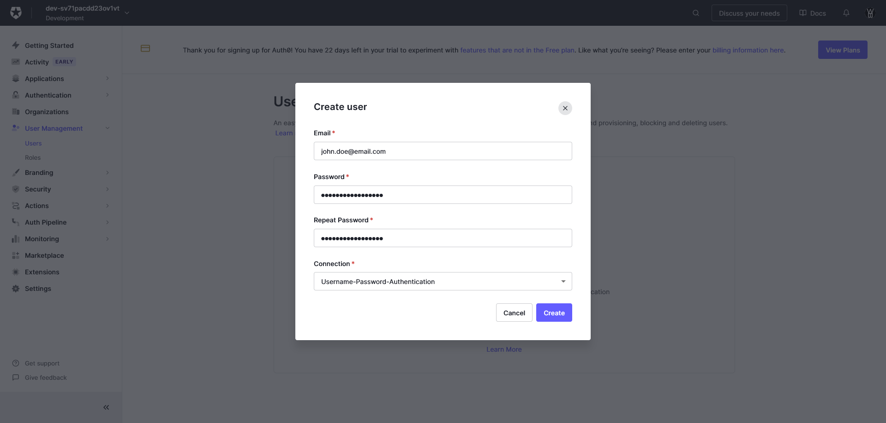

# Auht0 setup

## Setup an Auth0 tenant

### 1. Create Auth0 account

First things first lets create a free account on Auth0 (an [Okta](https://www.okta.com/) product) by visiting [their website](https://auth0.com/).

Press the `Sign up` button on the landing page navbar.

<details>
  <summary>Image example</summary>
  
</details>

This will redirect you to their sign up page. Here you can choose what method you want to use to create your free Auth0 account.

<details>
  <summary>Image example</summary>
  
</details>

Once you have choosen what way you want to sign up the setup wizard will want to know what `account type` you want. Here we want to choose `Other` before we continue.

<details>
  <summary>Image example</summary>
  
</details>

You have now created your Auth0 account and a new `tenant` is created for you automatically 😄 Unless you want an additional tutorial from Auth0 press `I have used Auth0 before` and then `Get started`

<details>
  <summary>Image example</summary>
  
</details>

### 2. Create an SPA application

Now its time to create the SPA (Single page application) we will need to run our project! Press on the `Create Application` button to get started.

<details>
  <summary>Image example</summary>
  
</details>

Here you can choose whatever name you want for the application. But more importantly we can choose the `Application type` and we want `Single Page Web Applications`. Then press `Create`.

<details>
  <summary>Image example</summary>
  
</details>

Once the application is created switch to the `Settings` tab. Here you will find your applications `Domain`, `Client ID` and `Client Secret` which we need. In your `.env` update the related variables with the info you have found.

```sh
PUBLIC_AUTH0_DOMAIN=<YOUR_AUTH0_DOMAIN>
PUBLIC_AUTH0_CLIENT_ID=<YOUR_AUTH0_CLIENT_ID>
AUTH0_CLIENT_SECRET=<YOUT_AUTH0_CLIENT_SECRET>
```

<details>
  <summary>Image example</summary>
  
</details>

Then we will need to scroll down until the `Application URIs` section. Here we need to input our clients url from the `.env` file. Unless you have changed it from the default, use `http://127.0.0.1:3000`. Then scroll down to the bottom and press `Save Changes`.

<details>
  <summary>Image example</summary>
  
</details>

### 3. Configure Auth0 for testing (Advanced)

All configuration from now assumes you have done the earlier steps and is only needed if you want to run certain tests for the app.

Continuing from the last step, just above the `Save Changes` button you will see a section called `Advanced settings`. Press it and open the tab `Grant Types`. Here you want to enable the `Password` grant type and the save your changes again (by pressing the `Save Changes` button).

<details>
  <summary>Image example</summary>
  
</details>

Now we move over to the general settings by pressing the `Settings` button in the sidebar. Then we scroll down to the section called `API Authorization Settings`. Here we want to set the `Default Directory` option to `Username-Password-Authentication` by typing and then click `Save`.

<details>
  <summary>Image example</summary>
  
</details>

Then we want to navigate to `User Managment` in the sidebar and then press the `Create User` button.

<details>
  <summary>Image example</summary>
  
</details>

Lastly we input a username and password for our test user. This user will be used in certain tests of the app. Whatever values you choose should be saved in the `.env` file after the user has been created!

```sh
AUTH0_TEST_USERNAME=<YOUR_TEST_USERNAME>
AUTH0_TEST_PASSWORD=<YOUR_TEST_PASSWORD>
```

<details>
  <summary>Image example</summary>
  
</details>

Now is the Auth0 configuration complete 🥳
