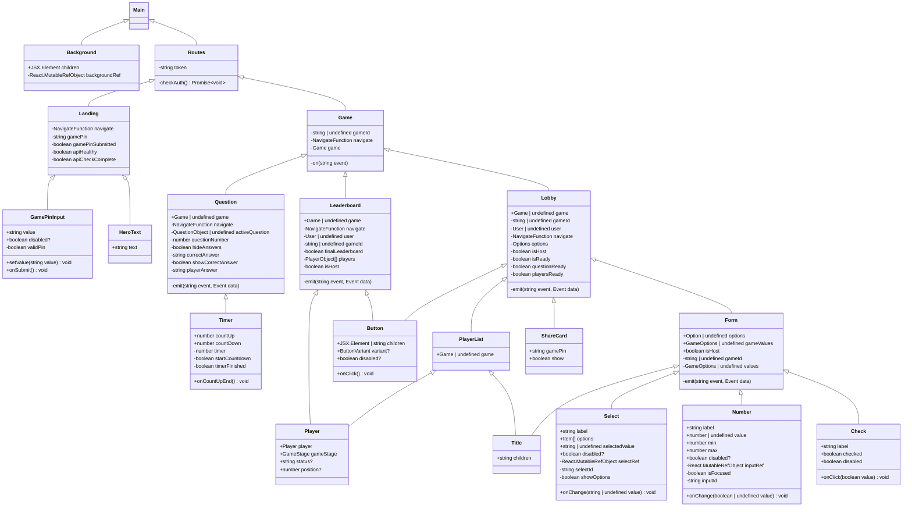

[← Go back](../README.md)

# Client class diagram

```mermaid
classDiagram
class Main

class Routes {
-checkAuth() Promise~void~
-string token
}


Main <|-- Background
Main <|-- Routes

Routes <|-- Landing
Routes <|-- Game

%% General components
class Background {
    +JSX.Element children
    -React.MutableRefObject backgroundRef
}

class Button {
    +JSX.Element | string children
    +onClick() void
    +ButtonVariant variant?
    +boolean disabled?
}

class Player {
    +Player player
    +GameStage gameStage
    +string status?
    +number position?
}

%% Landing route + components + relations
class Landing {
    -NavigateFunction navigate
    -string gamePin
    -boolean gamePinSubmitted
    -boolean apiHealthy
    -boolean apiCheckComplete
}

class GamePinInput {
+string value
+setValue(string value) void
+boolean disabled?
+onSubmit() void
-boolean validPin
}

class HeroText {
+string text
}

Landing <|-- GamePinInput
Landing <|-- HeroText

%% Game routes
class Game {
    -string | undefined gameId
    -NavigateFunction navigate
    -on(string event)
    -Game game
}

%% Lobby route + components + relations
class Lobby {
    +Game | undefined game
    -string | undefined gameId
    -User | undefined user
    -emit(string event, Event data)
    -NavigateFunction navigate
    -Options options
    -boolean isHost
    -boolean isReady
    -boolean questionReady
    -boolean playersReady
}

class Form {
    +Option | undefined options
    +GameOptions | undefined gameValues
    +boolean isHost
    -string | undefined gameId
    -emit(string event, Event data)
    -GameOptions | undefined values
}

class Check {
    +string label
    +boolean checked
    +boolean disabled
    +onClick(boolean value) void
}

class Number {
    +string label
    +number | undefined value
    +number min
    +number max
    +boolean disabled?
    +onChange(boolean | undefined value) void
    -React.MutableRefObject inputRef
    -boolean isFocused
    -string inputId
}

class Select {
    +string label
    +Item[] options
    +string | undefined selectedValue
    +boolean disabled?
    +onChange(string | undefined value) void
    -React.MutableRefObject selectRef
    -string selectId
    -boolean showOptions
}

class PlayerList {
    +Game | undefined game
}

class ShareCard {
    +string gamePin
    +boolean show
}

class Title {
    +string children
}

Lobby <|-- Button

Lobby <|-- PlayerList
Lobby <|-- ShareCard
Lobby <|-- Form

PlayerList <|-- Player
PlayerList <|-- Title

Form <|-- Title
Form <|-- Select
Form <|-- Number
Form <|-- Check


%% Leaderboard route + relations
class Leaderboard {
    +Game | undefined game
    -NavigateFunction navigate
    -User | undefined user
    -emit(string event, Event data)
    -string | undefined gameId
    -boolean finalLeaderboard
    -PlayerObject[] players
    -boolean isHost
}

Leaderboard <|-- Player
Leaderboard <|-- Button

%% Question route + components + relations
class Question {
    +Game | undefined game
    -NavigateFunction navigate
    -QuestionObject | undefined activeQuestion
    -number questionNumber
    -boolean hideAnswers
    -string correctAnswer
    -boolean showCorrectAnswer
    -string playerAnswer
    -emit(string event, Event data)
}

class Timer {
    +number countUp
    +number countDown
    +onCountUpEnd() void
    -number timer
    -boolean startCountdown
    -boolean timerFinished
}

Question <|-- Timer

%% Game route realtions
Game <|-- Question
Game <|-- Leaderboard
Game <|-- Lobby
```
